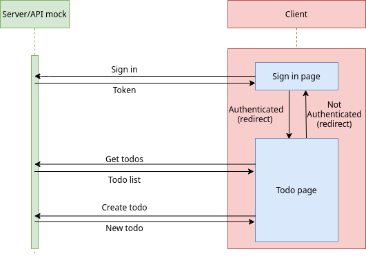

## Welcome to Manabie coding challenge

*Hello!*
*We're excited that you're interested in joining the Manabie. Below are the requirements and explanations for the challenge.*

### Notes: 
- Our challenge codebase is based on create-react-app with typescript.
- All provided codes are in this repository. Please fork, complete your challenge, and create a PR for us.
- We judge your codes:
    - Easy to understand.
    - Well organized.
    - Performant.
    - Test cases.
    
### Simple app diagram


### Requirements

#### Common (required in both position)
- Our code base has some strange bugs adn anti-patterns, please help us find and fix these (please comment the reason why you change it).
- Write some tests to persuade us that your code is correct.

#### Front-end engineer
- For front-end side only, you can use local state instead of remote state.
- We provided you a simple UI for todo app, please enhance it with your creative mind (We prefer not using any CSS framework as we want to see your CSS skill).
- Please split the huge line of codes in App.tsx into reusable UI components.
- Please help us implement a completed todo list by:
    - Implement the persistent feature. After refreshing, our created todos will be disappeared, that's annoying for our users.
    - Implement the edit functionality. Currently, users cannot edit the created todo, please help them (user double-click the todo to edit, press enter to apply the changes, or click outside to discard)

#### Fullstack engineer
- You have to make sure your code satisfy the back-end requirements in https://github.com/manabie-com/togo.
- We do not require you to enhance the UI, but it is preferable.
- Done the common requirements above.

### How to run this code
- Run ```yarn``` or ```npm install``` if this is the first time you clone this repo (`master` branch).
- Run ```yarn start:fullstack``` in case you are doing a fullstack test, else run ```yarn start:frontend``` to start this project in development mode.
- Sign in using username: `firstUser`, password: `example`
